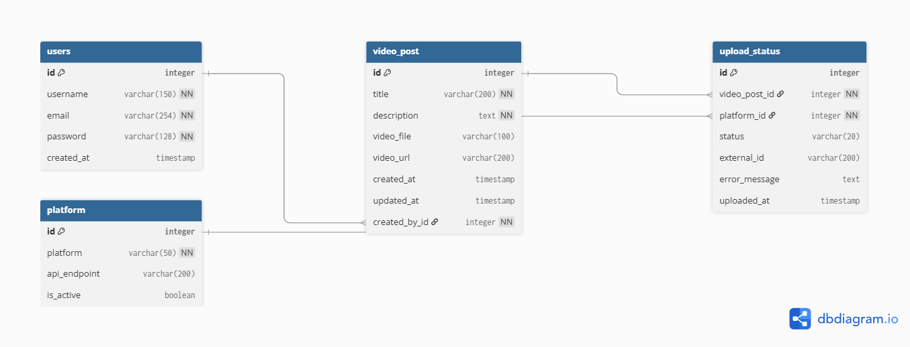

# Video Upload Automation Task

This is a Django-based project designed to automate video uploads to multiple platforms, including YouTube, Vimeo, and Dailymotion. The system integrates with the real YouTube API for uploads, while Vimeo and Dailymotion are simulated for demonstration purposes.

## Table of Contents
- [Project Overview](#project-overview)
- [Features](#features)
- [Project Structure](#project-structure)
- [Prerequisites](#prerequisites)
- [Installation](#installation)
- [Obtaining YouTube API Credentials](#obtaining-youtube-api-credentials)
- [Usage](#usage)
- [API Integration Details](#api-integration-details)
- [Database Design](#database-design)
- [Postman Collection](#postman-collection)
- [Demo](#demo)
- [Contributing](#contributing)
- [License](#license)

## Project Overview
This project provides a web interface (via Django Admin) and API endpoints to manage and upload videos to various platforms. Videos can be uploaded either as files or URLs, with validation rules enforced based on the selected platform.

## Features
- Upload videos via file or URL.
- Support for multiple platforms (YouTube, Vimeo, Dailymotion).
- Real-time status tracking (Pending, Uploading, Success, Failed, Partial Success).
- OAuth 2.0 authentication for YouTube uploads.
- Simulated upload processes for Vimeo and Dailymotion.

## Project Structure
```
video-upload-automation-task/
├── manage.py
├── requirements.txt
├── social_video_uploader/
│   ├── __init__.py
│   ├── settings.py
│   ├── urls.py
│   └── wsgi.py
├── video_uploader/
│   ├── __init__.py
│   ├── admin.py
│   ├── apps.py
│   ├── models.py
│   ├── serializers.py
│   ├── services/
│   │   └── upload_manager.py
│   │   └── platform_services.py
│   ├── tests.py
│   └── views.py
└── video-uploader-db-design.png  # Database design image
```

## Prerequisites
- Python 3.8+
- Django 5.2+
- pip
- virtualenv (recommended)
- Google Cloud SDK (for YouTube API credentials)

## Installation
1. Clone the repository:
   ```bash
   git clone https://github.com/OmarMuhammmed/video-upload-automation-task.git
   cd video-upload-automation-task
   ```
2. Create a virtual environment and activate it:
   ```bash
   python -m venv venv
   source venv/bin/activate  # On Windows: venv\Scripts\activate
   ```
3. Install dependencies:
   ```bash
   pip install -r requirements.txt
   ```
4. Apply migrations:
   ```bash
   python manage.py migrate
   ```
5. Create a superuser:
   ```bash
   python manage.py createsuperuser
   ```

## Obtaining YouTube API Credentials
To use the YouTube upload feature, you need to obtain `YOUTUBE_CLIENT_ID` and `YOUTUBE_CLIENT_SECRET` from Google Cloud Console and configure the redirect URI.

### Steps for Clients:
1. **Create a Google Cloud Project**:
   - Go to [Google Cloud Console](https://console.developers.google.com/).
   - Click on **Create Project**, enter a name (e.g., "Video Upload App"), and click **Create**.

2. **Enable YouTube Data API**:
   - In the Cloud Console, navigate to **APIs & Services** > **Library**.
   - Search for "YouTube Data API v3" and click **Enable**.

3. **Configure OAuth Consent Screen**:
   - Go to **APIs & Services** > **OAuth consent screen**.
   - Select **External** and click **Create**.
   - Fill in the required fields (e.g., App name, User support email).
   - Under **Authorized domains**, add `localhost`.
   - Save and continue.

4. **Create OAuth 2.0 Credentials**:
   - Go to **APIs & Services** > **Credentials**.
   - Click **Create Credentials** > **OAuth 2.0 Client IDs**.
   - Choose **Application type** as **Web application**.
   - Set **Name** (e.g., "Video Upload Client").
   - Under **Authorized redirect URIs**, add:
     ```
     http://localhost:8192/oauth2callback
     ```
   - Click **Create**.
   - Copy the **Client ID** and **Client Secret** from the popup.

5. **Update `settings.py`**:
   - Open `social_video_uploader/settings.py`.
   - Add the following lines with your credentials:
     ```python
     YOUTUBE_CLIENT_ID = 'your-client-id-here'
     YOUTUBE_CLIENT_SECRET = 'your-client-secret-here'
     YOUTUBE_REDIRECT_URI = 'http://localhost:8192/oauth2callback'
     ```
   - Save the file.

6. **Test the Configuration**:
   - Run the server: `python manage.py runserver`.
   - Access the Admin panel (`http://localhost:8000/admin/`) and try uploading a video to YouTube.

## Usage
1. Start the development server:
   ```bash
   python manage.py runserver
   ```
2. Log in to the Django Admin panel at `http://localhost:8000/admin/` using your superuser credentials.
3. Navigate to **Video Uploader > Video Posts** and click **Add Video Post**.
4. Fill in the details (Title, Description, Video File or URL, Platforms).
5. Save to initiate the upload process. For YouTube, an OAuth flow will prompt for authorization.

## API Integration Details
- **YouTube**: Fully integrated with the real YouTube Data API v3 for video uploads using OAuth 2.0 authentication.
- **Vimeo and Dailymotion**: Simulated uploads for demonstration. No real API calls are made; statuses are mocked.

## Database Design
The database schema is designed to manage video posts, platforms, and their upload statuses. Below is the visual representation:



## Postman Collection
- Download and import the Postman collection: [Video Upload API Collection](https://documenter.getpostman.com/view/35038234/2sB3BKFTeP)

## Demo
- Check out the live demo: [Video Upload Demo](https://drive.google.com/file/d/16deKcFYjLtHJ2FdrsWgn4WAOcQLwcR7_/view?usp=sharing)

## Contributing
Feel free to submit issues or pull requests. Ensure you follow the project's coding standards.

## License
This project is licensed under the MIT License.